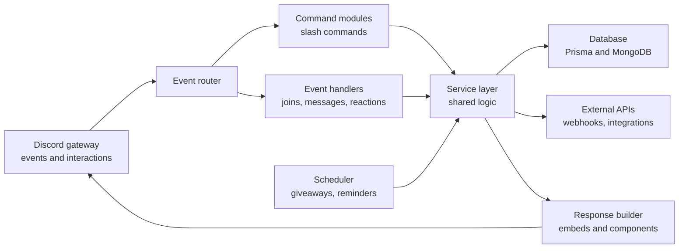
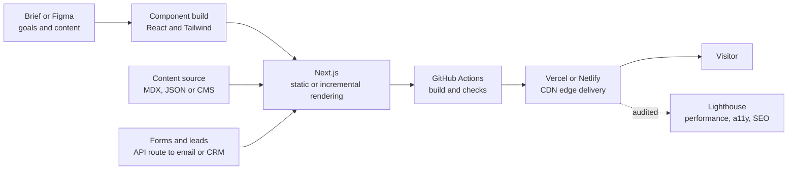

<!-- ═══════════════════════════════════════════════════════════════════════════
     Md. Ikram Hossain — Frontend Developer · Discord Bots · Automation
     Profile README for github.com/Itzzikram

     POSITIONING NOTE
     Frontend is the core skill. Discord bots and automation tooling are the
     strong secondary. Backend is presented as working knowledge, not a
     specialism — deliberately, because overstating it loses the client on the
     first technical call instead of at the proposal stage.

     MAINTENANCE NOTES
     - Every external URL here was verified to return HTTP 200.
     - The header is self-hosted at assets/header.svg. No third-party render
       service, so it cannot break when someone else's free tier runs out.
     - Keywords belong in visible headings, prose and alt text. Hidden
       keywords in HTML comments are not indexed and read as spam.
     - Mermaid renders natively on GitHub. Validate before committing.
     ═══════════════════════════════════════════════════════════════════════════ -->

  
  
  

  
  
  

---

## Overview

I'm a **frontend developer** who builds **web interfaces, landing pages, portfolio sites and web apps** — mainly with **React, Next.js, TypeScript and Tailwind CSS**. Alongside that I build **custom Discord bots** and **automation tools**, which is where a good share of my client work comes from.

What I care about on the frontend is the stuff users actually feel: pages that load fast on a mid-range phone, layouts that don't break at awkward widths, interfaces that work with a keyboard and a screen reader, and markup that search engines can read properly.

I also handle the **backend pieces a project needs** — API routes, form handling, authentication, a database layer — enough to ship what I build end to end. I'm straight with clients about the line: if a project needs heavy backend architecture or infrastructure work, that's not my specialism and I'll say so up front.

**Where I'm strongest**

| Focus | What I deliver |
|:---|:---|
| **Frontend & UI development** | Component-driven React and Next.js builds, responsive layouts, accessible interactive UI, design-to-code from Figma |
| **Landing pages & portfolio sites** | Fast, conversion-focused single-page sites with clean SEO markup and working forms |
| **Discord bots** | Moderation, tickets, giveaways, roles, logging and custom commands on a modular, maintainable codebase |
| **Automation tools** | Scripts and tooling for repetitive work — scraping, syncing, scheduled jobs, webhook integrations |
| **Web apps** | Multi-page dashboards and tools with auth, data fetching and state management |
| **Supporting backend** | REST API routes, auth flows, database modelling for the projects I build |

---

## How I approach a build

- **Performance is a requirement, not a polish step.** Images sized and lazy-loaded, fonts subset, bundles kept small, third-party scripts questioned. A landing page that takes six seconds on mobile has already lost the visitor.
- **Accessible by default.** Semantic HTML, real focus states, keyboard-operable components, labelled forms, colour contrast that passes. It costs nothing when built in from the start and is expensive to retrofit. Full conformance still needs manual testing with assistive tech, so I flag what I've verified rather than claiming a blanket pass.
- **Responsive means every width, not three breakpoints.** Layouts tested through the awkward in-between sizes where most sites quietly break.
- **Components over copy-paste.** A design system small enough to hold in your head, so adding a section later doesn't mean rebuilding one.
- **SEO handled in the markup.** Proper heading order, meta and Open Graph tags, descriptive alt text, sensible URLs — the parts that are actually under a developer's control.
- **Handover you can use.** Readable code, a setup guide and notes on how to change the things you'll want to change.

---

## Selected work

Public source, links resolve, code is there to read.

### Rimuru — modular Discord bot

**Repo:** [Itzzikram/Rimuru](https://github.com/Itzzikram/Rimuru) · **TypeScript**

Multipurpose bot covering moderation, automated giveaways, social integrations and server utilities. Multipurpose bots usually rot — features pile up until every addition risks breaking something older. This one is built as isolated command modules over a typed Prisma data layer, so features go in independently and schema changes are migrations instead of guesswork.

Closest reference point if you want a custom bot: same structure, adapted to your server's roles, rules and workflows.

**Notes**

- Command modules are self-contained and independently testable
- Prisma gives a typed boundary between handlers and the database, so schema drift shows up at compile time
- Scheduled work like giveaway resolution survives a restart instead of living in memory

`TypeScript` `Discord.js` `Prisma` `MongoDB`

---

### DemonZ-Ripper — full-stack tool with a real-time React interface

**Repo:** [Itzzikram/DemonZ-Ripper](https://github.com/Itzzikram/DemonZ-Ripper) · **TypeScript** · 5 stars

A monorepo that captures 3D assets from WebGL scenes and exports them to GLB, glTF 2.0, OBJ and Unreal UAsset. The part I'd point a frontend client at is the interface: a React UI streaming live progress from a long-running backend job, which is a genuinely awkward UI problem — partial state, failures mid-run, and progress that has to stay readable while it updates.

**Notes**

- React frontend driving and monitoring a long-running job without freezing or lying about state
- Fastify and Puppeteer backend orchestrating headless browser work
- Four export formats generated from one intermediate representation
- Containerised with deployment configuration included

`TypeScript` `React` `WebGL2` `Fastify` `Puppeteer` `Docker`

---

### Discord-Advance-Cloner — automation tooling under rate limits

**Repo:** [Itzzikram/Discord-Advance-Cloner](https://github.com/Itzzikram/Discord-Advance-Cloner) · **TypeScript + Rust**

Automation tool that replicates server structure — roles, channels, permissions, webhooks, threads, emojis — against an API that aggressively rate-limits. The interesting work is failure handling: exponential-backoff retry and fallback paths so a partial failure degrades instead of dying halfway through.

**Notes**

- Exponential backoff with fallback, so transient errors don't abort a whole run
- Cross-platform builds for Windows, Linux and macOS
- Performance-sensitive path in Rust behind a TypeScript interface

`TypeScript` `Rust` `Docker`

---

### Discord-Unban-Platform — stretch project in Rust

**Repo:** [Itzzikram/Discord-Unban-Platform](https://github.com/Itzzikram/Discord-Unban-Platform) · **Rust**

Included honestly: this one is me pushing past my comfort zone rather than a core skill. It's a moderation platform built to learn **Rust** and **event-driven architecture** — Kafka for task orchestration, Redis to coordinate rate limits across workers, Postgres for an audit trail, JWT and RBAC for approvals.

I'm not selling myself as a distributed-systems engineer. I'm showing that I'll take on unfamiliar territory and see it through, which is usually the thing that actually matters on a project.

`Rust` `Kafka` `Redis` `PostgreSQL` `Docker`

---

## How I build and ship a site

Landing pages and portfolio sites are a large part of my work, so here's the actual pipeline rather than a vague promise of quality.

**What that buys you**

- Statically rendered where possible, so pages arrive fast and rank properly
- Content editable without touching layout code
- Forms that actually reach your inbox or CRM, with validation and spam handling
- Every push built and checked before it goes live
- Measured against Lighthouse rather than assumed to be fine

---

## Technical stack

<table>
<tr><td valign="top" width="34%">

**Frontend — core**

React · Next.js · TypeScript · JavaScript · Tailwind CSS · Vite · HTML5 · CSS3

**UI & UX**

Responsive layout · accessibility · component systems · CSS animation · Figma to code

**Discord & automation**

Discord.js · discord.py · slash commands · webhooks · schedulers · Puppeteer scraping

</td><td valign="top" width="33%">

**Backend — working knowledge**

Node.js · Express · REST API routes · authentication and sessions · MongoDB · PostgreSQL · Prisma

Enough to ship my own projects end to end. Not positioned as a specialism — for heavy backend architecture you want a backend specialist.

**Data & content**

Prisma · MongoDB · PostgreSQL · SQLite · MDX · JSON and REST integrations

</td><td valign="top" width="33%">

**Tooling & deployment**

Git · GitHub · GitHub Actions · Vercel · Netlify · npm · Figma · Postman · Docker basics

**Languages beyond JS**

Python for automation and bots · Rust at a learning level

**Currently learning**

Rust · event-driven architecture · deeper testing practice

</td></tr>
</table>

---

## Working together

<table>
<tr><td valign="top" width="50%">

**What I take on**

| Type | Typical shape |
|:---|:---|
| **Landing page** | Single-page marketing or product site, responsive, SEO-ready |
| **Portfolio site** | Personal or studio site, often with a CMS or MDX content layer |
| **Web app** | Dashboard or tool with auth, data fetching and state |
| **Discord bot** | Custom bot built to your server's rules and workflows |
| **Automation tool** | Script or service that removes a repetitive manual job |
| **Fixes & improvements** | Speeding up, repairing or finishing an existing frontend |

<!-- Rates deliberately unpublished. If you add them, avoid low anchors —
     a "from $50" figure filters for clients who argue over every revision. -->

</td><td valign="top" width="50%">

**Included every time**

- Written scope before implementation starts
- Repo access from the first commit, not at handover
- Responsive and cross-browser checked, not just desktop Chrome
- Accessibility and performance reviewed before delivery
- Setup and deployment documentation
- Full source ownership transferred, no lock-in
- A defined support window for defects after delivery
- Direct communication, with progress visible in the repo

</td></tr>
</table>

**How a project runs**

| Stage | Activity | Output |
|:---|:---|:---|
| **1 · Scope** | Goals, content, references, timeline | Written brief and estimate |
| **2 · Structure** | Page or feature layout, component plan, data needs | Agreed structure before build |
| **3 · Build** | Component-driven implementation in milestones | Reviewable commits, preview link |
| **4 · Review** | Responsive, cross-browser, accessibility and performance passes | Audit results and fixes |
| **5 · Launch** | Deployment, domain, analytics, form delivery | Live site and setup notes |
| **6 · Support** | Defect window, optional ongoing work | Fixes and documented handover |

---

## Contact & connect

**Hiring me?** A direct message is fastest. Tell me what you're building, roughly when you need it and any constraints, and I'll come back with a straight answer on fit — including when the work would be better handled by someone else.

**Just saying hello?** Also welcome. I'm happy to talk shop, compare notes on a stack, or collaborate on something open source.

  
  
  

<!-- ══════════════════════════════════════════════════════════════════════════
     READY-TO-ENABLE CONTACT BADGES
     ══════════════════════════════════════════════════════════════════════════
     Only verified, working links are live above. Everything below is built and
     styled — swap in the real URL and delete the comment markers around the
     one you want, one line at a time.

     Why they are not already live: the version of this section that was
     drafted earlier pointed at linkedin.com/in/your-profile,
     twitter.com/your-handle, your-email@example.com and your-portfolio.com.
     Four dead links, and they sit in the exact spot where a client decides to
     get in touch. A contact section with two working links converts better
     than one with six links where four go nowhere.

     It also carried a visible line reading "Tip: Update the links above with
     your actual information" — a note to yourself that would have been
     published to every visitor. Removed.

     PRIORITY ORDER for a frontend developer:
       1. Portfolio  — a live site you built is your single strongest asset.
                       For frontend work it outperforms every other link here.
       2. Email      — many business clients will not use Discord.
       3. LinkedIn   — where clients verify you are a real person.
       4. X/Twitter  — optional, only if you actually post.

  

  

  

  

     Freelance marketplace profiles are worth adding too — they carry public
     reviews, which is third-party proof you cannot provide yourself:

  

  
     ══════════════════════════════════════════════════════════════════════════ -->

**Availability** Open to new work · **Hours** UTC+6, flexible for overlap · **Languages** English, Bengali

<b>GitHub activity metrics</b>

 

<!-- github-readme-stats.vercel.app is intentionally unused: its shared public
     instance was returning 503 on every request when this was written,
     including for unrelated accounts, having exhausted its GitHub API quota.
     For those cards, deploy a private instance — free, with its own quota:
     https://github.com/anuraghazra/github-readme-stats#deploy-on-your-own -->

---

Frontend developer for hire · React and Next.js development · landing page and portfolio website development · custom Discord bot development · automation tools and scripts · TypeScript, JavaScript, Python · remote, worldwide

